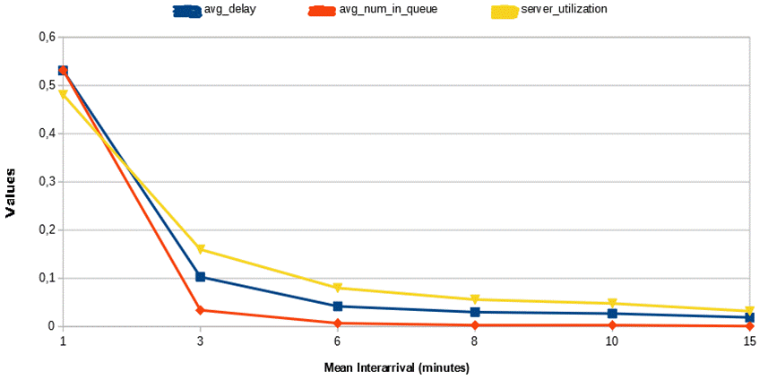
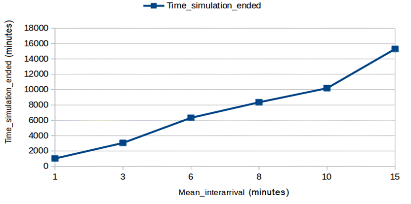
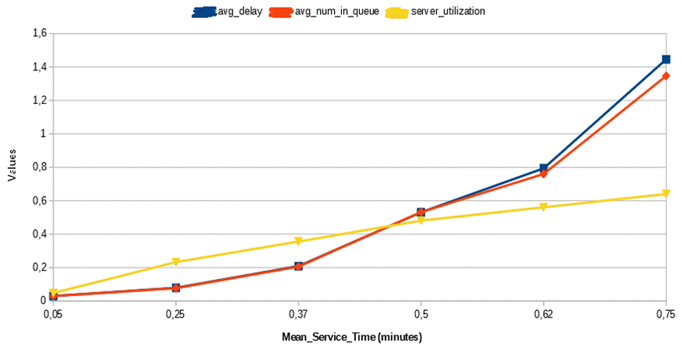
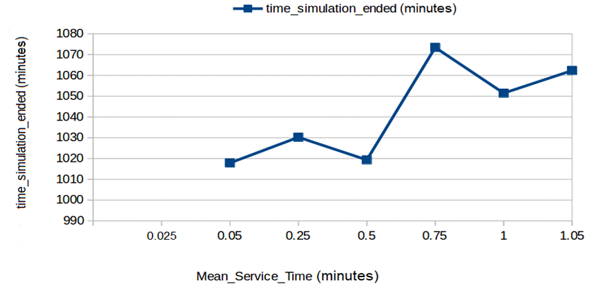
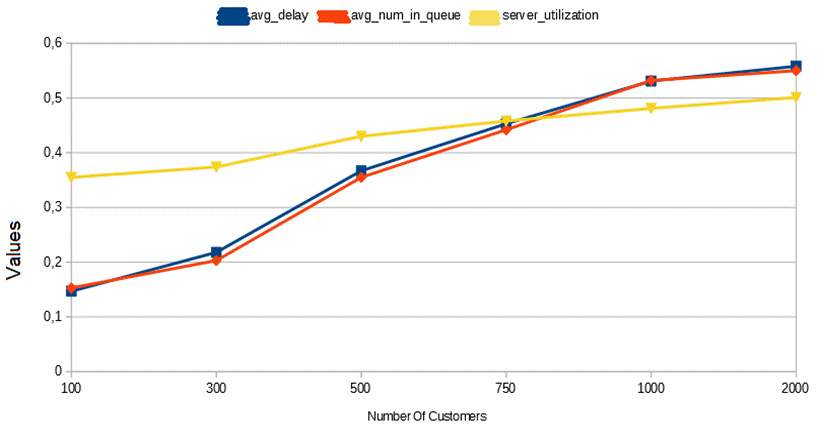
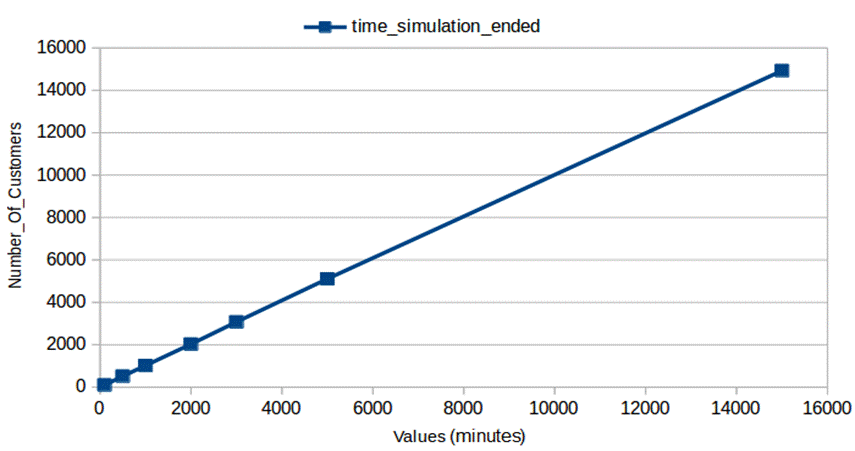
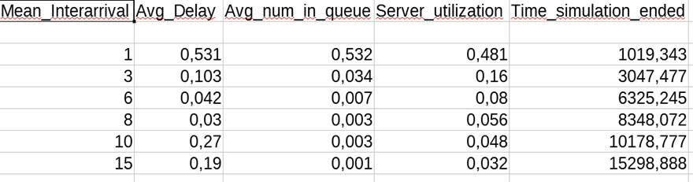
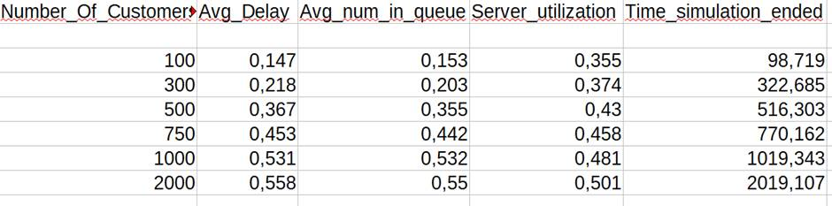
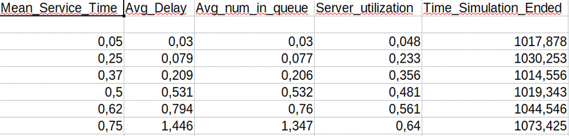

## ΠΡΑΚΤΙΚΗ  ΑΝΑΛΥΣΗ  ΕΝΟΣ  Μ/Μ/1  ΣΥΣΤΗΜΑΤΟΣ

&nbsp; &nbsp; &nbsp; Το παρόν αναφέρεται σε στατιστικές ενδείξεις ενός συστήματος M/M/1. Εμπεριέχει ένα πρόγραμμα γραμμένο σε γλώσσα προγραμματισμού C. Το πρόγραμμα αυτό λαμβάνει τιμές για το μέσο χρόνο άφιξης (mean_interarrival), το μέσο χρόνο εξυπηρέτησης (mean service time) και τον αριθμό των απαιτούμενων εξυπηρετήσεων ή αλλιώς τον αριθμό των πελατών (number of customers in queue) από ένα αρχείο mm1.in, το οποίο αναπαριστά ένα απλό σύστημα M/M/1. Επιπρόσθετα, εξάγει σε ένα αρχείο mm1.out τις τιμές της μέσης καθυστέρησης στην ουρά (Average delay in queue), του μέσου όρου πελατών μέσα στην ουρά (Average number in queue), της ποσοστιαίας χρησιμοποίησης του διακομιστή (Server utilization) και του ποσοστιαίου χρόνου που διήρκησε η προσομοίωση (Time simulation ended). Είναι άξιο να σημειωθεί ότι η ουρά αυτού του συστήματος, μπορεί να χωρέσει το πολύ 100 πελάτες. Κατά την εκτέλεση του παραπάνω αλγορίθμου, διατηρούνται δύο από τα mean interarrival, mean service time, number of customers με σταθερές τιμές και μεταβάλλεται η τιμή του τρίτου. Όμως, προτού εξεταστούν αυτές οι τρεις περιπτώσεις, αξίζει να σημειωθεί ο νόμος του Little.

&nbsp; &nbsp; &nbsp; Βάσει του νόμου του Little, ισχύει  N  =  λ * W, όπου N ο μέσος αριθμός πελατών, λ ο μέσος ρυθμός άφιξης και W ο μέσος χρόνος αναμονής μέσα στο σύστημα.  

### Περίπτωση 1η 

&nbsp; &nbsp; &nbsp; Στην πρώτη εξέταση του παρόντος, μεταβάλλεται ο μέσος χρόνος άφιξης (μετρημένος σε λεπτά), καθώς παραμένουν σταθεροί ο μέσος χρόνος εξυπηρέτησης και ο αριθμός των πελατών. Για την παρακάτω γραφική συνάρτηση ο μέσος χρόνος εξυπηρέτησης είναι ίσος με 0,5 λεπτά και ο αριθμός των πελατών είναι 1000.

&nbsp; &nbsp; &nbsp; Είναι προφανές ότι, όσο αυξάνεται ο μέσος χρόνος άφιξης, οι τιμές της μέσης καθυστέρησης στην ουρά (average delay), του μέσου όρου πελατών μέσα στην ουρά (average number of customers in queue) και της ποσοστιαίας χρησιμοποίησης του διακομιστή (server utilization) μειώνονται εκθετικά. Ισχύει ότι ο μέσος ρυθμός άφιξης είναι ίσος με ένα προς το μέσο χρόνο άφιξης. Αυτό μπορεί να γίνει αντιληπτό, εάν σκεφθεί κανείς, ότι όσο πιο αραιά (από άποψη χρόνου) έρχονται πελάτες σε ένα ATM μιας τράπεζας, τόσο λιγότερη καθυστέρηση, άτομα στην ουρά και ποσοστιαία χρήση του ATM (βάση όλης της χρονικής διάρκειας που έμεινε ανοιχτό, μέχρι να εξυπηρετηθούν όλοι οι πελάτες) θα υπάρξει.

&nbsp; &nbsp; &nbsp; Ακόμη, φαίνεται ότι ο χρόνος, που διήρκησε η προσομοίωση, είναι ανάλογος με το μέσο χρόνο άφιξης. Σύμφωνα με το προηγούμενο παράδειγμα, εάν οι πελάτες έρχονται ολοένα και πιο αραιά, τόση περισσότερη ώρα θα χρειαστεί το ATM να παραμείνει ανοιχτό (εάν θεωρήσουμε ότι μένει ανοιχτό μέχρις ότου να εξυπηρετηθούν όλοι οι πελάτες).
 

### Περίπτωση 2η 

&nbsp; &nbsp; &nbsp; Στη δεύτερη περίπτωση μετασχηματίζεται ο μέσος χρόνος εξυπηρέτησης (μετρημένος σε λεπτά), καθώς παραμένουν σταθεροί ο μέσος χρόνος άφιξης και ο αριθμός των πελατών. Για την παρακάτω συνάρτηση ο μέσος χρόνος άφιξης είναι ίσος με 1 λεπτό και ο αριθμός των πελατών είναι 1000.
 

&nbsp; &nbsp; &nbsp; Συμπεραίνεται από το παραπάνω γράφημα, ότι καθώς αυξάνεται ο μέσος χρόνος εξυπηρέτησης, αυξάνουν εκθετικά και οι τιμές της μέσης καθυστέρησης στην ουρά, του μέσου όρου πελατών μέσα στην ουρά και της ποσοστιαίας χρησιμοποίησης του διακομιστή. Και αυτό είναι λογικό, εφόσον, όσο περισσότερος χρόνος απαιτείται για την εξυπηρέτηση των πελατών (κατά μέσο όρο), τόσο μεγαλύτερη καθυστέρηση και πελάτες θα έχουμε στην ουρά, όπως επίσης και ποσοστιαία χρησιμοποίηση του διακομιστή.

 
&nbsp; &nbsp; &nbsp; Ωστόσο, ο μετασχηματισμός του χρόνου εξυπηρέτησης δεν παρουσιάζει μεγάλες αλλαγές στο χρόνο που διήρκησε η προσομοίωση. Στην προκείμενη περίπτωση οι τιμές κυμαίνονται (περίπου) από 1014 μέχρι και 1062 λεπτά, δηλαδή περίπου 2% η μέγιστη μεταβολή. Αυτό συμβαίνει, γιατί παρόλο που αυξάνεται ο απαιτούμενος χρόνος για την εξυπηρέτηση των πελατών, αντί να διαρκέσει παραπάνω χρόνο η προσομοίωση, απλά χρησιμοποιείται παραπάνω ο διακομιστής ποσοστιαία. 
 

### Περίπτωση 3η 

&nbsp; &nbsp; &nbsp; Τέλος, μετατοπίζεται ο αριθμός των πελατών, καθώς παραμένουν σταθεροί ο μέσος χρόνος άφιξης και ο μέσος χρόνος εξυπηρέτησης. Για την παρακάτω συνάρτηση ο μέσος χρόνος άφιξης είναι ίσος με 1 λεπτό και ο μέσος χρόνος εξυπηρέτησης είναι ίσος με 0,5 λεπτά.

&nbsp; &nbsp; &nbsp; Εξάγεται από το παραπάνω ότι, καθώς ο αριθμός των πελατών αυξάνεται, οι τιμές της μέσης καθυστέρησης στην ουρά, του μέσου όρου πελατών στην ουρά και της ποσοστιαίας χρησιμοποίησης του διακομιστή αυξάνονται εκθετικά. Είναι προφανές ότι με περισσότερους πελάτες σε ένα σύστημα, θα υπάρχει μεγαλύτερη μέση καθυστέρηση, μεγαλύτερος μέσος όρος πελατών στην ουρά και μεγαλύτερη ποσοστιαία χρησιμοποίηση του διακομιστή.

 

&nbsp; &nbsp; &nbsp; Τέλος, παρατηρείται ότι ο αριθμός των πελατών είναι ανάλογος με το χρόνο που διήρκησε η προσομοίωση. Μάλιστα οι τιμές τους είναι σχεδόν ίσες, αν όχι εντελώς ίσες, υπό την προϋπόθεση ότι ο χρόνος προσομοίωσης μετριέται σε λεπτά.

 

### Πίνακες δοκιμών

&nbsp; &nbsp; &nbsp; Ο αλγόριθμος εκτελέστηκε με διάφορες τιμές ως είσοδο. Βάσει των παρακάτω τιμών, σχεδιάστηκαν τα παραπάνω γραφήματα.

Για Number of Customers = 1000 και Mean Service Time = 0.5

Για Mean Interarrival =1 και Mean Service Time = 0.5

Για Mean Interarrival =1 και Number of Customers = 1000

 

